# Implementation

This chapter will cover the implementation details of VaGo, reviewing the proposed software design and discussing
whether it was followed, or if some modifications were required and why.

## Parser

_The following files are contained in the extractor package._

The parser will obtain information from the markdown file and store it in the proposed Out structure type. Therefore,
the first step here would be to define the shape of this struct, which contains the following attributes:

* H1: A string.
* H2: String array.
* H3: String array.
* H4: String array.
* H5: String array.
* H6: String array.
* Content: Full HTML content, containing all the information from the markdown file in one variable.
* P: String array.
* Ul: String array.
* Ol: String array.
* Link: String array.
* Image: String array.

This struct will allow the user to navigate over the multiple input tokens, iterating over them to follow the same order
it was provided initially. Moreover, the user can obtain multiple headings and paragraphs using index navigation. This
is done with the purpose of providing flexibility for templating when giving structure to the content.

On the other hand, if the user decides to use the automatic, same structure from markdown, they can simply output
Content which will display everything in HTML format already.

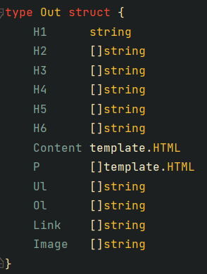

Next, the parser will make use of this structure to store values. Moreover, as mentioned previously, VaGo makes use of
the `gomarkdown` package to construct the Abstract Syntax Tree, with some slights modifications. These modifications are
required because, otherwise, all the HTML content will be stored in a single variable, and this does not offer the
possibility of building a flexible template system obtain values from different variables.

Therefore, the navigation of the AST must be modified to extract the given content as desired. This navigation is done
via the `gomarkdown` function named `ast.WalkFunc`, which offer the possibility to get through every child node of the
tree. During this walk, the titles will be obtained first as no additional logic is required besides detecting whether
the given token is a heading or not, and what specific heading is being read.

Nonetheless, for the rest of the content, further logic must be applied. This is due to the fact that, although there
are multiple paragraphs, these can be grouped in a single section given the agreement that every section is split by a
title. Hence, the array `P` will store multiple paragraphs in one single index following this logic.

It is important to note that this does not include the first heading, given that it is assumed there will be only one
per page (as main title) to follow the W3C accessibility norms for titles.

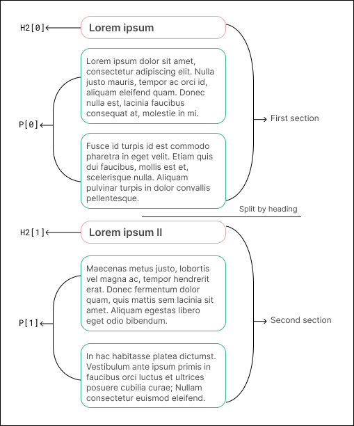

This logic is implemented as follows: If a heading is detected, a new section upcoming, meaning that the index for `P`
must be incremented. Otherwise, store the content in the current index for `P`.

However, this approach is context-awareness lacking, leading to problems when deciding what's the current index, what
would be the next one, and knowing whether the AST walker is already in a section. The lack of awareness can be
problematic in certain circumstances, for instance, what happens if there are two contiguous titles, meaning that no
paragraphs are added but the index shouldn´t increment either.

For this reason, a new structure is defined to track these process, named ContentTracker, which stores the current index
amount, and a boolean specifying whether the tracker is inside a section or not.

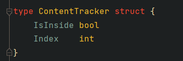

Consequently, the logic for parsing the content will be as follows:

When a heading is identified, the program should examine the tracker boolean to determine if it is located within the
heading. If the boolean value is true, it should be changed to false. Additionally, the index should be incremented by
one if the current paragraph is not empty. If it isn't inside, set it to true.

In the event that a non-heading is identified, the tracker should be updated to indicate that it is inside (i.e., set to
true). Subsequently, the markdown text should be retrieved and saved to the variable `P` at the current index of the
tracker.

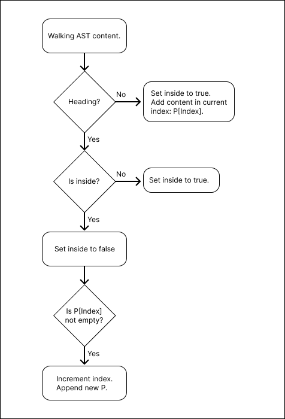

As a result of the gomarkdown AST walking mechanism's behavior, the parser is required to execute a skip children
operation when a content token (excluding headings) is identified. This is done to prevent redundant readings of inner
children within the paragraphs, such as bold, italic, and links. These elements have already been stored in the fully
parsed HTML representation of the paragraph.

This is accomplished by evaluating the content extraction function, which will return true if it's in presence of
content, and false in case of a heading.

Finally, the AST extraction function ends up with the following anatomy, returning the provided document and the filled
Out structure variable.

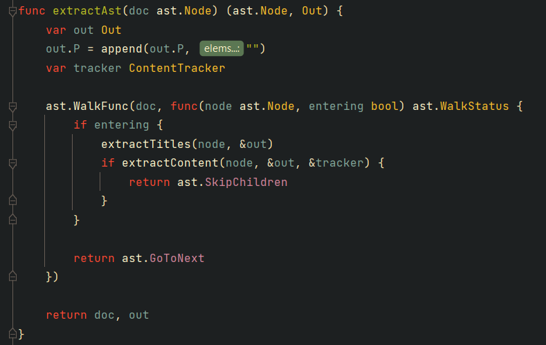

This all is encapsulated in a public function named ParseMarkdown, where it will set up the gomarkdown to begin the AST
walk, use previous function to build the Out structure, and finally render everything to be stored in Out.Content.

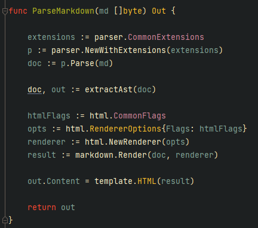

## Generator

_The following files are contained in the generator package_

The generator process is fairly simple as it will limit itself to obtain the parsed content and construct files through
a template on the specified output folder.

### Build pages

First, it will build the pages, taking every markdown file from the input folder, obtain its content, parse it using the
ParseMarkdown function from previous package, take the provided template, create a new file with the same name but
changing the extension to .html, and output the result of this template with the Out content. The last two steps are
encapsulated in the function buildPage for simplicity.

This same process is repeated for each input file to create its HTML version accordingly.

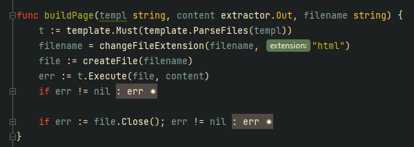

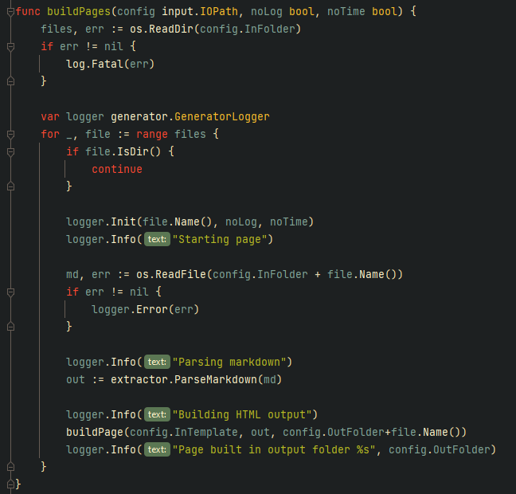

### Build styles

Secondly, the same process is repeated for the theme styles, except for a few modifications as some steps are not
required: Instead of parsing the content, it will get it from a YAML file with the variables to adapt, and these will be
added to a given CSS file, generating a new one in the output folder. This last step is encapsulated in function named
buildStyle.

This same process is repeated for all files contained in the given styles folder.

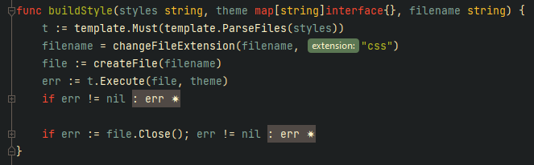

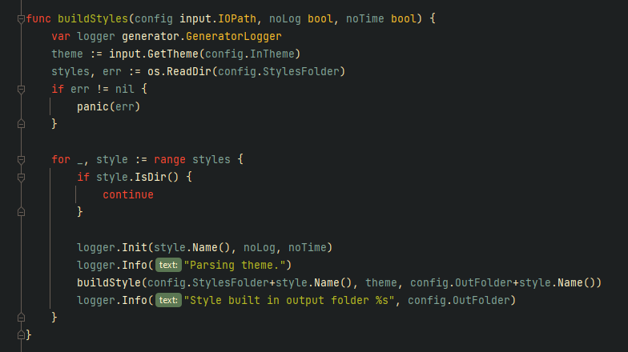

It is worth noting that throughout this whole process, a logger is in place and being used to keep the user informed of
every step performed, using the established structure with timestamp, page name and logging information. Logger
implementation is explained later on following sections.

## Server

The server implementation is characterized by its simplicity, as it primarily consists of two core components: the
listener, responsible for actively monitoring incoming requests, and the router, which directs these requests based on
their respective target URLs.

The implementation utilizes the net/http package in Go to establish a server and manage incoming requests in a suitable
manner. The following code snippet demonstrates the creation and utilization of a router handler within the
ListenAndServe function, which will create file server from a provided directory.

This function accepts a specified port and the router handler as parameters, enabling the determination of appropriate
actions for each incoming request. It is noteworthy that the router necessitates an input directory from which to
retrieve the files for serving. This input directory is acquired through the configuration variables supplied by the
user.

The Serve function, which is the primary public function utilized by the remaining components of the system, is
responsible for initiating the server.

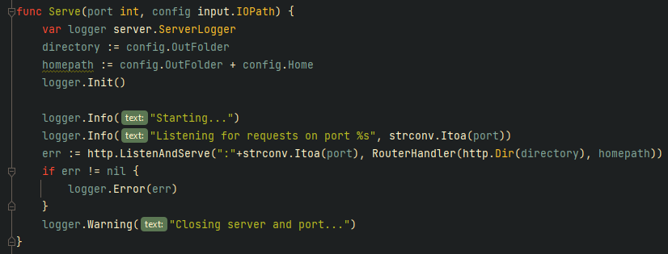

Subsequently, the router is equipped with supplementary logic to decide the appropriate files to transmit. This is
particularly important in cases where the requested file from the destination URL cannot be found, necessitating the
transmission of a 404 page.

Furthermore, in cases where a destination URL is not explicitly mentioned, it is imperative for the system to generate
the home page. The user is required to submit the home page information in the configuration file, and the path to the
home page must be set as a function parameter for the RouterHandler.

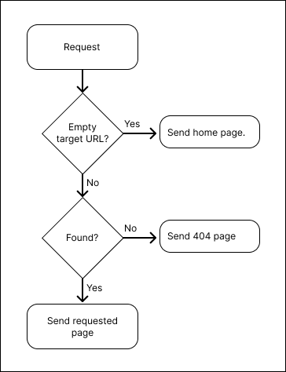

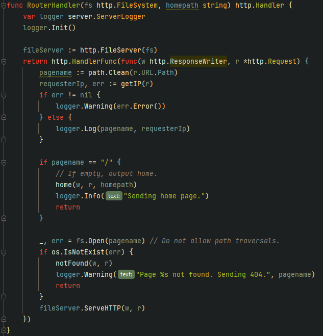

## Logger

As described in previous chapters, the project will need two types of loggers with their clear differences: Generator
Logger and Server Logger. Notwithstanding, these both share similar functionality, which includes display information,
have different level of logging (information, warning, error) and include a prefix.

Therefore, to ensure the same structure is followed, Go interfaces has been put in place, enforcing the development to
follow the functions described on each, and reducing the cognitive load:

* Logger interface, with three functions for each logging level: Info, Warning and Error. The idea is that the developer
  can simply use each function accordingly and the system will output the information sent as parameters (similar to
  fmt.Println) with a prefix establishing the given level.

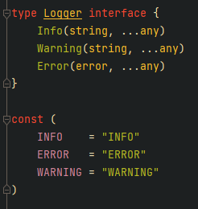

* Prefixer interface, short and simple with only one function: Prefix. This helps to encapsulate the prefixing logic,
  and build prefixes independently of the logger.

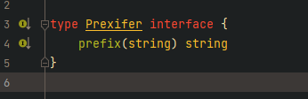

Then, the implementation of each logger is dedicated to its requirements and functionality.

### Generator Logger

Instantiated by an Init function, where the developer can specify in advance the pagename to log as a prefix, and
whether it should include timestamps or no logs at all. These last two parameters are taken by the prefixer, which will
take care of the prefixing log information.

Moreover, the logging functions, Info, Warning and Error will simply take the prefixer and use the Prefix function to
add the logging level, followed by the logging text, which may or not have arguments to add to the text, similar to what
is done in fmt.Print, adding extra formatting options for flexibility.

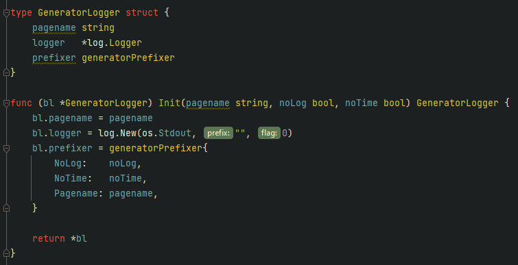

### Generator Prefixer

Here the prefixer will take care of the timestamp in RFC822 format, whether the logs should be printed or not and the
prefixed log level, and the file/page name to be logged. Doing so allow the prefix to be flexible according to the
established configuration.

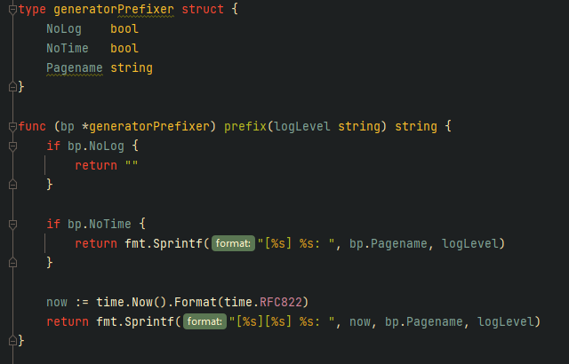

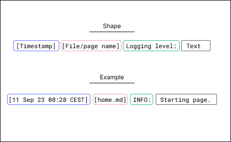

## CLI

As mentioned in previous chapters, the CLI is developed with urfave/cli package, which allow customization for commands
using typical Linux CLI format, displaying the information required from the user to execute them successfully. This
information includes the following:

* Build
    - Name: build.
    - Flags: _config_ (--c), _no-log_ (--nl) and _no-time_ (--ct).
    - Description: Build/Generate web content from markdown files on indicated folder (default: config.yaml).

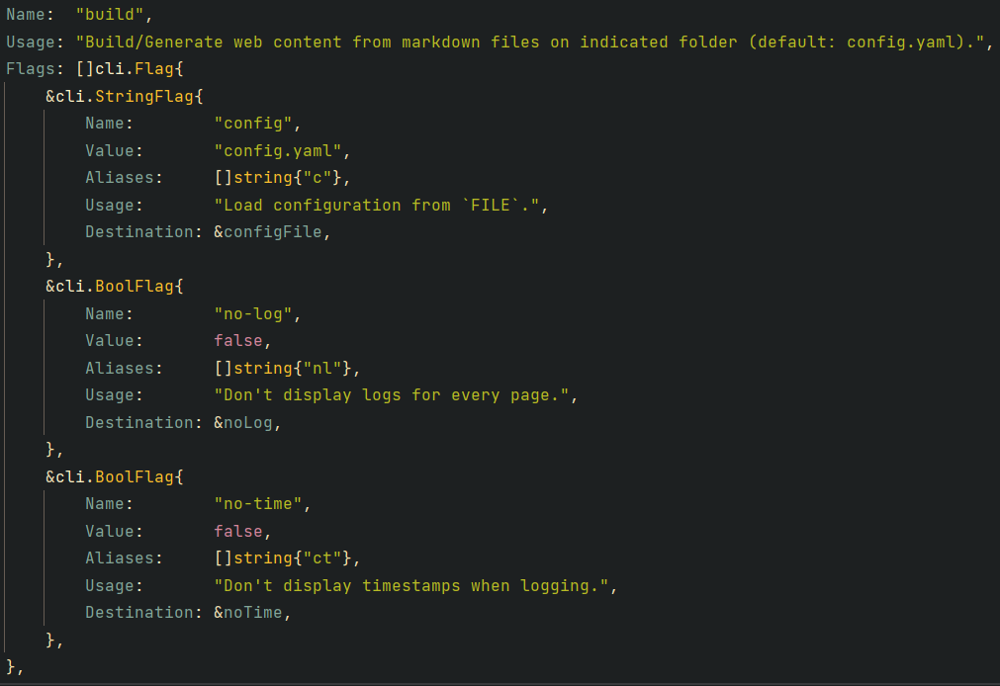

* Serve
    - Name: serve.
    - Flags: _port_ (--p) and _config_ (--c).
    - Description: Start serving generated content via specific port (default: 8080).

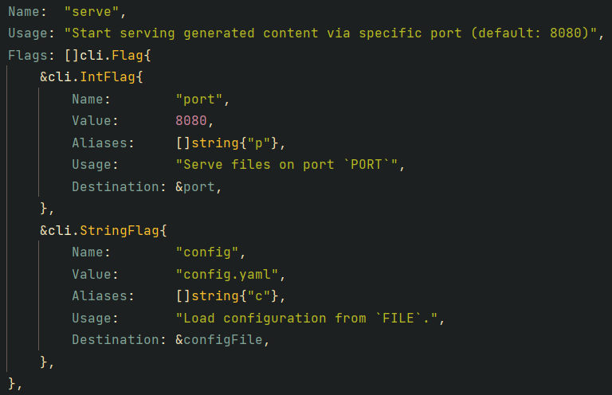

For both commands, the common flag, config, is meant to be used to indicate the entry configuration file, which contains
information about input and output folders, templates, styles, theme and homepage. For Build, no-log and no-time are
used to indicate the system to not print logs at all and to not display timestamps, accordingly. For Serve, the port
flag is used to specify the port number to be used.

Moreover, the package provides the utility to display help usage for both commands, including the main VaGo application.
This documentation provides information about the command's description, usage of every flag, input type, default values,
short command, and how to correctly structure the operation. 

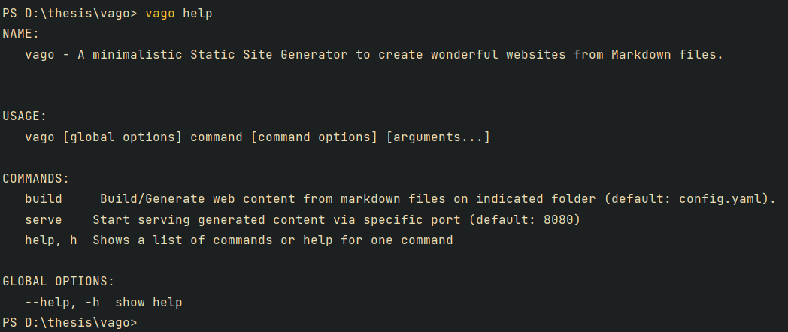

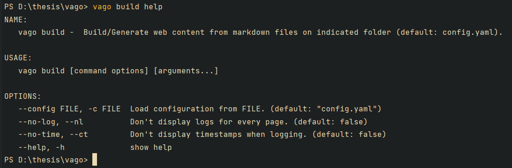

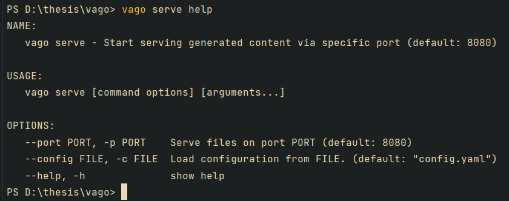

Finally, when a Build command is called, it will execute the Build function from the generator package, sending the 
configuration file (reading it through a helper function to get YAML files), no-log and no-time as parameters.

On the other side, the Serve command will execute the Serve function from the server package, sending the port number 
and configuration file as parameters.

Both commands are specified in the Action field for urfave/cli package command type. 

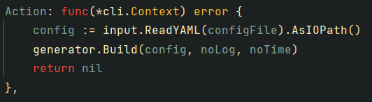

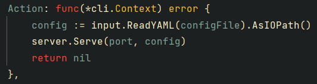
