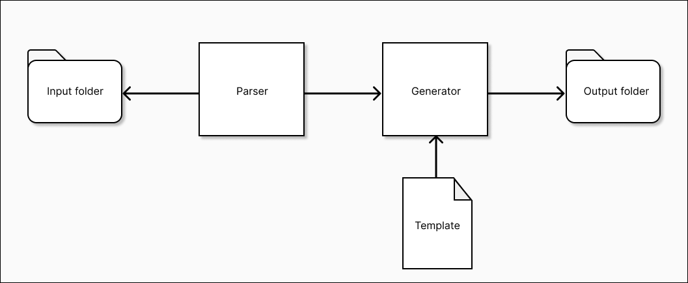
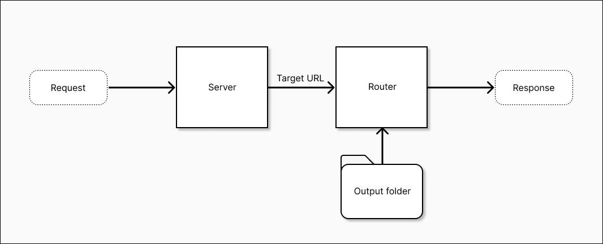

# Software Design

## Overview

The VaGo Static Site Generator, as presented in this project, is designed to be utilized by fellow developers for the
purpose of creating straightforward and user-friendly websites, prioritizing content over any additional functionalities
offered by the site. Hence, the paramount consideration lies in the user-friendly nature of VaGo, which allows for
enhanced concentration on content during usage.

In this manner, VaGo should possess the capability to parse markdown files and convert them into web pages.
Additionally, it should be able to serve this content through a designated port, while implementing automatic routing
based on the file name to URL convention. Furthermore, VaGo should ensure that the user remains informed about each step
executed by the Static Site Generator (SSG) through consistent and informative logging.

Therefore, the design of VaGo is significantly dependent on and focused on the following essential elements: **Parse**,
**construct**, **serve**, **route**, and **log**. This section will now propose a recommendation for the implementation
of these components and an approach to construct their interconnection, in accordance with fundamental programming
principles, with the aim of developing software that exhibits both robustness and maintainability. It is important to
acknowledge that the content presented in this chapter is merely a proposal, subject to potential changes or
modifications throughout the implementation phase. This flexibility is necessary as additional challenges and
requirements may emerge.

## Context

As seen in previous chapters, VaGo is not the first static site generator available in the market. Numerous frameworks
provide a plethora of features, surpassing the mere provision of static content. These frameworks offer extension
capabilities through the utilization of various programming languages, support input format files other than markdown,
incorporate plugins, and present additional functionalities.

With that being stated, VaGo does not aim to revolutionize existing practices or challenge the current state of the
field through novel technologies or approaches. Instead, it seeks to investigate the potential of developing a static
site generator (SSG) independently. This exploration involves determining the extent to which one can achieve desired
outcomes while maintaining simplicity. Additionally, VaGo offers users the advantage of incorporating specific features
tailored to their projects without necessitating the acquisition of new skills or adaptation to unfamiliar technologies
or frameworks that may not fully meet their requirements.

Furthermore, this study aims to investigate the potential introduction of novel elements that deviate from the
conventional norms of similar projects. It seeks to evaluate the use of these features and engage in a discourse
regarding potential areas for enhancement.

Considering this perspective, it is imperative that the project's development remains focused on minimalism and
simplicity, while also allowing room for both maintainability and extension. Therefore, while it may lack the capability
to provide plugins like other frameworks, the code base should possess a high level of comprehensibility and
extensibility, allowing for the creation and integration of new features.

## Goals (and non goals)

Following is a list of essential points that must be specified and elaborated upon in this design document. In an effort
to isolate the development process on the principal features and prevent wasting time, it also includes functionalities
that are not expected to be developed further.

**Goals**

* The code is characterized by its minimalistic design, simplicity, ease of use, and readability.
* The decoupling of functionalities into several files, or modules, serves to isolate the code according to its intended
  purpose.
* It is imperative that each module maintains a singular focus on a certain purpose or functionality. Hence, the
  fundamental functionalities will be divided into one or more modules, namely Parse, Construct, Serve, Route, and Log.
* The code will possess a certain degree of opinionation due to the project's inherent characteristics and software
  requirements. This design choice limits the extent of customization available to users, hence facilitating ease of
  use.
* The project's development will be closely aligned with the limitations and recommended methodologies of the
  programming language.
* Additional features can be incorporated if deemed necessary, following a thorough examination of the rationale behind
  their implementation.

**Non goals**

* Extensibility via plugins or external modules.
* Multiple language development. Only the one chosen will be used.
* Integration with other known technologies, except for the ones included in the standard web industry.
* Usage of design patterns that may over-complicate the code base, unless they are strictly required and proven to be
  useful for the project needs.

## Proposed Solution

### Parser

Based on the prioritization of VaGo's features, the initial module to be built pertains to the parsing of markdown file
content. Hence, the proposed methodology entails the process of reading, detecting, and storing tokens for various text
elements such as titles/headings, links, bold formatting, italic formatting, and others. These tokens are then stored in
variables based on their respective content types.

Moreover, in order to enhance convenience, it is imperative to consolidate these variables into a singular variable,
such as a map or array, since this approach can facilitate the process of relocation, interpretation, and retrieval. The
use of a struct variable type enables the accomplishment of this task, given that the programming language employed is
Go.

As a result, via the accomplishment of this task, the users of this module are able to effectively interact by accessing
the information included within this variable alongside the information retrieved from the markdown. This extracted
material can subsequently be utilized to construct the pages in accordance with a specified template.

In this manner, the suggested architecture will incorporate the designation `Out` to facilitate the identification of
its intended functionality. The primary function responsible for extracting the content will be denoted as `
ParseMarkdown`. This function will accept the markdown file content as a parameter and ultimately yield an instance of
the `Out` struct, populated with the parsed content.

### Constructor/Generator

After the extraction and parsing of the material, the system is required to identify and interpret the template files
provided by the user. This process enables the generation of HTML pages that incorporate the extracted text. Hence, the
chosen directory for input files will be iteratively accessed within a loop, with each file being processed according to
the provided specifications to generate the corresponding pages.

The utilization of the Out structure within the templating system allows users to determine the appropriate structure by
adhering to the pre-established naming convention for the Out variables. After the establishment of this configuration,
the system will utilize these templates in accordance with the previously outlined methodology.

Therefore, the system will not only retrieve each input file, analyze its content, extract the templating, and generate
the newly parsed HTML content, but it will also generate new files specifically for this purpose within the designated
output folder. The encapsulation of the described functionality will be implemented within the `Build` function, which
will accept the input folder location, template file, and output folder as parameters.

Both the Parser and Generator will work together in the same phase named as "Build", which consists mainly on taking the
Markdown content and template in order to build the HTML content. This same name will be then used by the CLI to
indicate the software to perform these actions.

The image belows provides a graphical explanation about the interaction between these modules along with the input
folder, template and output folder.

### Server

This module is pretty simple as its main purpose is to open a port on localhost to start listening to requests, which
will be then managed by a router using the `/[target]` URL format.

Moreover, the function `Serve` will be in charge of exposing this behavior to start serving files, with the port number
and the folder with the content to be sent as parameters.

### Router

The basic objective of the system is to efficiently handle incoming requests by receiving a designated folder containing
the content to be served. It then automatically generates and delivers the appropriate pages based on the file names and
the corresponding target URLs. In order to do this task, it is necessary to iterate through the files included within
the designated folder. During this process, the program should identify each file name and afterwards locate the file
that corresponds to the requested URL. Once located, the information will be delivered back to the IP address of the
individual making the request.

If a file name is not discovered, the system should generate a 404 page. This page can either be provided by the user in
advance or a default page can be used.

Similarly to previous modules (generator and parser) used in the Build stage, Server and Router are meant to be used
together to accomplish another task: Serve. This will be on charge of managing every incoming HTTP request and handle
them accordingly to the target URL, whether this exist as a page in the output folder or not. The following diagram 
provides more context on the relationship between these as to provide guidance on their interaction and desired outcome. 

### Logger

It is imperative that during the entirety of the aforementioned modules, the system maintains constant communication
with the user, providing updates and notifications regarding all ongoing activities. This is necessary to guarantee the
user's awareness and facilitate comprehensive understanding of each individual activity.

According to this, it is necessary to implement an adaptive logging system that is tailored to each phase, as each step
possesses distinct information to offer and certain requirements to fulfill. Specifically, it is necessary for one
logger to furnish details pertaining to the construction of each page, while another logger should supply information
regarding requests, encompassing the IP address of the requester, the requested page, and the status of the router.

Furthermore, it is imperative for the loggers to accurately record the precise date and time of each event that takes
place.

Hence, it is appropriate to designate the logger responsible for the generation and parsing phases as `BuilderLogger`,
and the logger responsible for serving and routing as `ServeLogger`. On the contrary, in order to enhance simplicity and
enhance readability, both loggers will employ a uniform interface to provide an equivalent Log function, which serves
the aim of displaying information pertaining to the ongoing activity.

### Development strategy

This project is meant to be very simple and minimalistic in terms of development. And on top of that, the language used,
Go, aims for simplicity on its syntax and usage.

There are multiple advantages for this, such as keeping an easier readability and enhanced capacity to understand what
is happening in a certain piece of code, but it also keeps the consistency and concrete structure over the whole
project, which will benefit later on when multiple pieces of code (modules) are connected, and the consumer of further
modules must be able to easily understand its interface and purpose, as it will allow the development process to not
only go faster but also to minimize the number of errors, and while there may appear some issues, the concreteness and
simplicity will make it easier to overcome and conquer the upcoming challenges.

Moreover, besides the already provided simple syntax from Go, and its recommended best practices, the development
process will make use of the Single-responsability principle[#], to encapsulate the multiple functionalities in
different modules/files, hence each one must serve to one single purpose.

As per this, if a structure is created, and there are some methods attached to this struct, these must remain in the
same file. On the other hand, if the struct does not have any methods, a single file must be defined for it, although it
won't have any other methods or functions.

Moreover, multiple functions that share or serve a single purpose, must be created in the same file.

Similarly, it is absolutely forbidden the creation of modules with ambiguous names such as 'util', where its purpose and
functionalities are not clear for the consumer. The module's name must explicitly reflect its purpose, and if the
collection of variables, functions and methods within it are not coherent, then the whole existence of this module must
be re-evaluated in order to follow a semantic meaning.

It is important to note that during the description of these strategies, the word "class" has not been mentioned, and
there is a relevant reason for that, which will be explained in the next topic.

#### Go vs OOP

Go, the programming language, by design, is meant to be Object Oriented Programming and at the same time it is not. This
limitation arises from the fact that, while it is feasible to construct a class-like abstraction of a tangible entity
using structures and methods, it lacks support for hierarchical relationships. Consequently, this necessitates that
developers employ abstractions at a single layer, simplifying the code by avoiding the accumulation of excessive levels
of complexity, and instead favoring the usage of composition.

Although certain teams may view this as a drawback, it is important to note that this particular attribute aligns
seamlessly with the objectives of the project, which prioritize simplicity and minimalistic code. This assertion is
supported by the aforementioned reasons.

Furthermore, it provides support for dynamic interfaces, which implies that there is no need to statically declare the
objects that implement specific interfaces. Instead, the interpretation of these interfaces occurs dynamically when the
corresponding methods are implemented.

In order to maintain simplicity in software interfaces, it is imperative to adhere to the design principle of limiting
the number of methods to a maximum of five. Additionally, the Interface Segregation principle should be observed to
prevent the creation of unnecessary interfaces. For an interface to be justified, it must possess two essential
qualities: a semantic purpose or meaning for its existence, and a clear enhancement to the code that cannot be achieved
through any other means.
